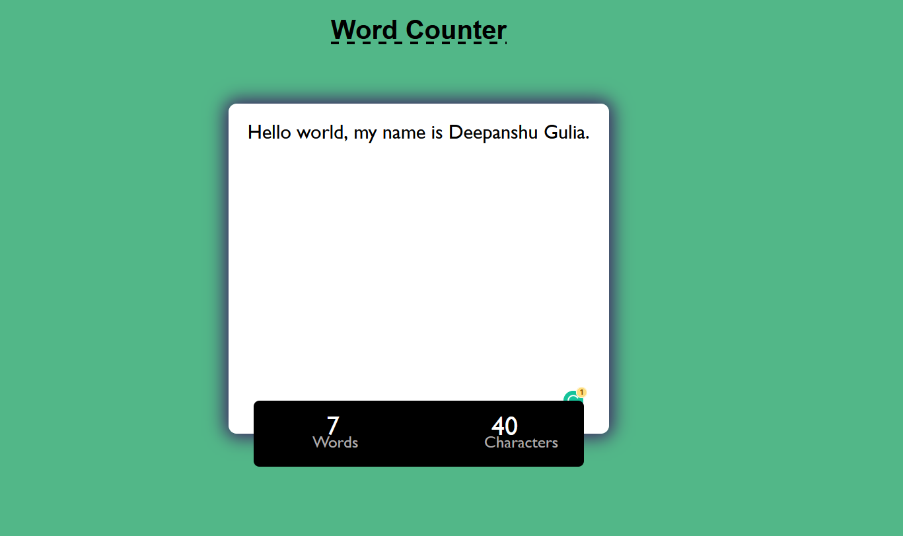

# word-counter
This is a solo small reactjs project. In this you will able to see how many words and character you have written. By this web app you can count words in you speech, essay, mail, etc. Just paste your paragraph in this app and you will able see word and characters.

### Made by :- Deepanshu Gulia

## Steps to run application on local server

* Clone this repository locally.
* <kbd>npm install</kbd> Then this command in terminal to install all npm packages.
* <kbd>npm run dev</kbd> Then run react by this command.

### Tech stack :- 
 HTML | CSS | Javascript| React | Vercel

## Image of project

Thank you ❤️
